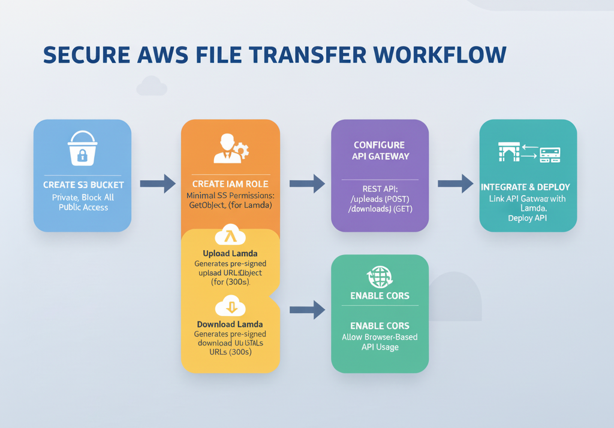
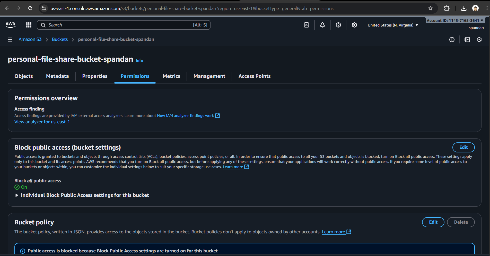
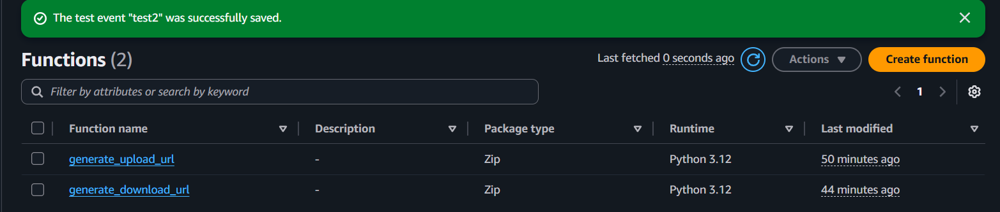
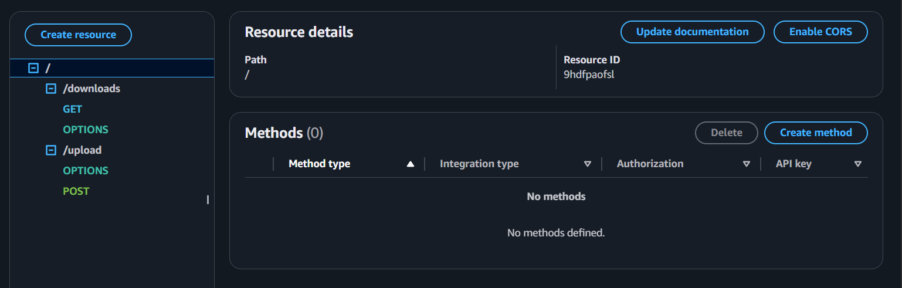
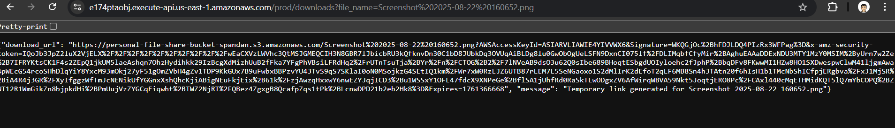
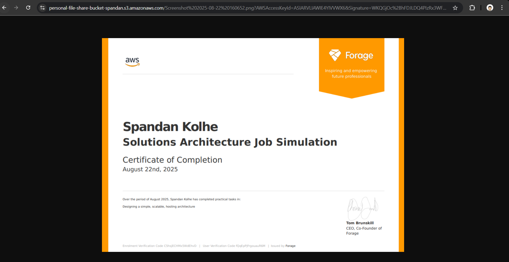

# Secure Serverless Personal File Sharing System (AWS S3 + Lambda + API Gateway)
## Introduction

A secure, serverless personal file sharing system built with AWS S3, Lambda, and API Gateway.
This project enables users to securely upload and download files using pre-signed URLs, ensuring that the S3 bucket remains private and inaccessible to unauthorized users.

The system reflects AWS best practices such as serverless design, least-privilege security, and managed API integration. It eliminates the need for a dedicated backend server, reducing administration overhead and optimizing scalability, cost, and performance.




## Objective

To design and implement a fully serverless architecture for secure personal file storage, while demonstrating practical skills in AWS cloud services, API development, and IAM-based access control.
This project highlights the ability to build secure, production-ready systems without exposing sensitive cloud resources to the public internet.

## Tools & AWS Services Used

- Amazon S3 – Private and secure storage for uploaded files.

- AWS Lambda – Generates pre-signed URLs for file upload and download operations.

- Amazon API Gateway – Provides RESTful API endpoints /uploads and /downloads for Lambda access.

- AWS IAM Roles & Policies – Enforces least-privilege permissions for Lambda to access S3.

- AWS Management Console – Used for setup, configuration, and deployment.

## Architecture Overview

- The architecture follows a serverless workflow:

- Client requests a pre-signed URL through API Gateway.

- API Gateway invokes the corresponding Lambda function.

- Lambda generates a pre-signed S3 URL (valid for 300 seconds).

- Client uploads or downloads the file using that URL securely.

- S3 stores data without exposing the bucket publicly.

## Key Benefits:

- No servers or EC2 instances to manage.

- Automatic scaling driven by API usage.

- Secure data exchange via IAM roles and time-limited URLs.

- Cost-effective pay-per-use model.


## Workflow & Implementation Steps
### Step 1: S3 Bucket Creation

Created an S3 bucket (e.g., personal-file-share-bucket-spandan) with public access blocked and versioning enabled for data protection.

Configured the correct bucket policy to prevent unintended public access.



### Step 2: IAM Role Creation

Defined a Lambda execution role following the principle of least privilege.

Attached a custom inline policy allowing only required S3 actions:
```
{
  "Version": "2012-10-17",
  "Statement": [
    {
      "Sid": "S3UploadDownloadPermissions",
      "Effect": "Allow",
      "Action": [
        "s3:GetObject",
        "s3:PutObject"
      ],
      "Resource": "arn:aws:s3:::personal-file-share-bucket-spandan/*"
    }
  ]
}
```

- Explanation:

Allows Lambda to generate pre-signed URLs to upload (PUT) and download (GET) objects in the specific S3 bucket.


### Step 3: Lambda Function Development

Developed two AWS Lambda functions using Python and boto3 SDK:

Upload Lambda – Generates pre-signed upload URLs (valid for 300 seconds).

Download Lambda – Generates pre-signed download URLs (valid for 300 seconds).

Assigned the IAM role to both functions for access control.

Deployed and verified functions in the AWS Lambda console.



### Step 4: API Gateway Configuration

Created a REST API to expose two endpoints:

POST /uploads → triggers upload Lambda

GET /downloads → triggers download Lambda

Configured Lambda integration type for both.

Enabled CORS support for browser/front-end integration.

Deployed the API to a prod stage for production-ready testing.



### Step 5: Integration & File Flow

Linked Lambda functions with API Gateway methods.

Upload Flow:

Client calls /uploads → receives pre-signed upload URL → uploads file directly to S3.

Download Flow:

Client calls /downloads with file name → receives pre-signed download URL → downloads file securely.





## Security Highlights

- No public S3 access: All file transfers occur through pre-signed URLs only.

- Least privilege IAM policy: Lambda functions restricted to only necessary actions.

- Temporary access: URLs automatically expire to prevent long-term exposure.

- Serverless isolation: No persistent compute resources reduce the attack surface.

## Key Learnings

- Understanding and applying serverless architecture principles using AWS.

- Implementing secure S3 access with private buckets and pre-signed URLs.

- Designing least-privilege IAM roles for Lambda functions.

- Integrating API Gateway with Lambda for serverless APIs.

- Managing temporary, secure file access in cloud environments.

- Deploying a scalable and cost-efficient solution without dedicated servers.

## Conclusion

This project demonstrates how to design and deploy a secure, serverless personal file sharing system using AWS native services.
The solution is:

Highly secure – strong IAM policies and URL-based access control.

Easily scalable – leverages AWS managed serverless infrastructure.

